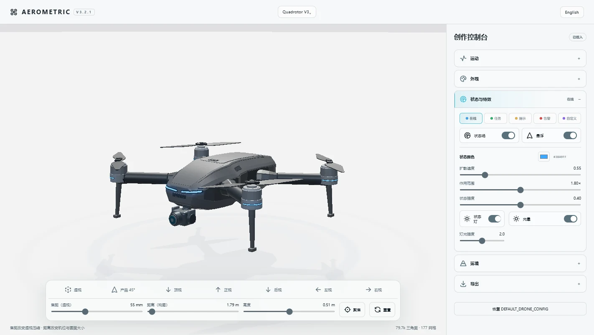

# AEROMETRIC

English | [简体中文](./README.zh-CN.md)

**Open Drone 3D Studio & Model Standard**

An open 3D drone studio, model standard, and AI-assisted creation toolkit for controllable GLB assets.

[](https://aerometric.vercel.app) [](./LICENSE) [](https://threejs.org/) [](./docs/en/model-standard-overview.md)

**[Launch Online](https://aerometric.vercel.app)** · **[AI Model Skill](./release/aerometric-0.1/skills/AI_START_HERE.md)** · **[Blender Kit](./release/aerometric-0.1/blender/README.md)** · **[Documentation](./docs/en/)**



## Features

| | Capability |
| --- | --- |
| **Customize** | Colors · Parts · Materials · Visibility |
| **Animate** | Rotors · Gimbal · Status Lights · Status Field |
| **Environment** | Sunny · Rain · Night · Ground Scene |
| **Import & Export** | GLB · PNG · JPG |
| **Create with AI** | AEROMETRIC Model Skill |
| **Create with Blender** | Template · Helper · Validator |

## Try Online

Open Studio → choose an official model or upload a GLB → adjust appearance, state, environment, and camera → export GLB, PNG, or JPG.

**[Open AEROMETRIC Studio](https://aerometric.vercel.app)**

The default Quadrotor V3 loads asynchronously. If a model cannot be loaded, Studio remains available for model selection and local GLB upload.

## Create with AI

Open the [AEROMETRIC AI Model Skill](./release/aerometric-0.1/skills/AI_START_HERE.md), give the complete Skill folder to Codex or another compatible AI agent, and ask it to read `AI_START_HERE.md`. The workflow guides the agent through hierarchy, pivots, materials, DroneProfile mapping, export, and re-import validation.

[Read the AI Skill guide](./docs/en/ai-model-skill.md) · [Open the Skill](./release/aerometric-0.1/skills/aerometric-model/SKILL.md) · [Download the AI Model Kit](./release/aerometric-0.1/artifacts/AEROMETRIC_AI_Model_Kit_0.1.zip)

## Build with Blender

The [Blender Creator Kit](./release/aerometric-0.1/blender/README.md) supports role tagging, rotor pivot validation, gimbal axis setup, status light tagging, hierarchy validation, and compatible GLB export. It is a creation aid; the Model Standard and validators remain the source of truth.

## Official Models

| Model | Role | Asset facts | Purpose |
| --- | --- | --- | --- |
| [Quadrotor V3](./release/aerometric-0.1/models/quadrotor-v3/README.md) | Default / Full Feature | 177 meshes · 79,708 triangles · 6 status lights · CC0-1.0 | Studio hero, default model, and full capability reference |
| [Reference Drone 01](./release/aerometric-0.1/models/aerometric-reference-drone-01/README.md) | Lightweight / Validation Reference | 2,928 triangles · 0.19 MB · CC0-1.0 | CI, validator, schema, low-performance, and Skill example |

Quadrotor V3 supports editable colors, visibility groups, rotor and gimbal control, status lights, status field, environments, and current-state GLB export. Reference Drone 01 intentionally stays small and predictable for automated validation.

V3 Bloom performance improved from approximately 12.3 FPS to 56.8 FPS in the recorded local baseline. Hardware and scene settings affect results; see the [full performance report](./release/aerometric-0.1/PERFORMANCE_V3.md).

## Compatibility Levels

- **Level 0 — Generic GLB:** valid GLB with view, camera, environment, and PNG/JPG output.
- **Level 1 — Profile:** GLB plus `.aerometric.json` for semantic parts, controls, and materials.
- **Level 2 — Native:** GLB with AEROMETRIC glTF extras for automatic semantic discovery.

See [Model Standard Overview](./docs/en/model-standard-overview.md) for the contract and validation workflow.

## Community Model Library

Community models are only listed when redistribution rights are explicit and AEROMETRIC validation passes. Library capabilities are derived from DroneProfile metadata instead of a second manual capability list.

[Browse the public index](./public/models/index.json) · [Contribute a model](./docs/en/contributing.md)

## Developer Quick Start

```bash
npm ci
npm run dev
```

Validation:

```bash
npm run test:source
npm run build
npm run validate:release
npm run check:publish
```

Repository layout:

```text
src/       Online Studio source
public/    Public assets and model library
release/   Versioned release packages
docs/      English and Simplified Chinese documentation
scripts/   Validation and build utilities
```

## Documentation

- [Getting Started](./docs/en/getting-started.md)
- [AI Model Skill Usage](./docs/en/ai-model-skill.md)
- [Model Standard Overview](./docs/en/model-standard-overview.md)
- [Release 0.1 Audit](./release/aerometric-0.1/RELEASE_AUDIT_0.1.md)
- [v0.1.1 Release Notes](./docs/en/release-notes-0.1.1.md)
- [简体中文文档](./docs/zh-CN/)

## Contributing

Start with the [contribution guide](./docs/en/contributing.md). Model submissions must include an explicit reusable license, pass the Profile and package validators, and satisfy the public Library license gate.

## License

- Code, documentation, Skill, Schema, Validator, and Blender tools: [MIT](./LICENSE)
- Quadrotor V3 assets: [CC0-1.0](./release/aerometric-0.1/models/quadrotor-v3/LICENSE)
- Reference Drone 01 assets: [CC0-1.0](./release/aerometric-0.1/models/aerometric-reference-drone-01/LICENSE)
- Community models: the individual `LICENSE` in each model package

Model licenses do not change the repository code license. See [Model Asset Licensing](./release/aerometric-0.1/MODEL_ASSET_LICENSE.md).
